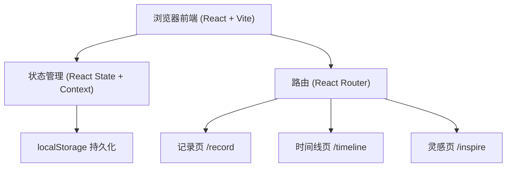
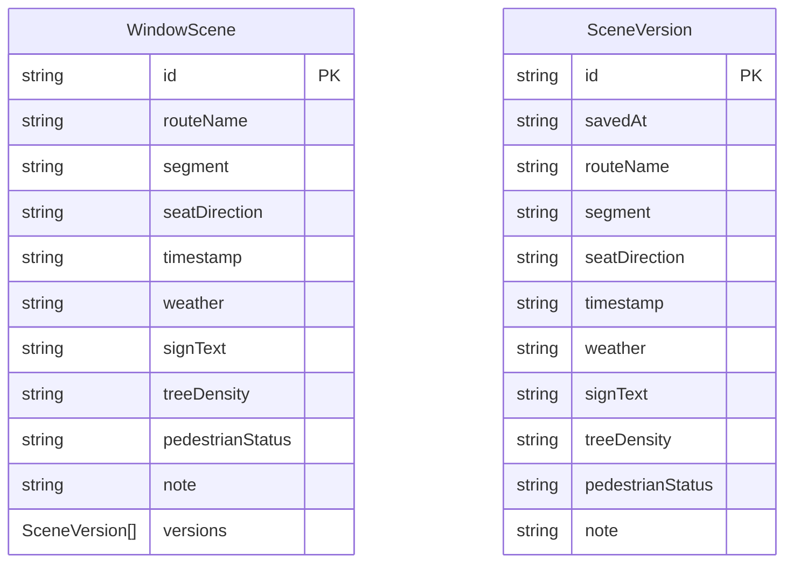

## 1. 架构设计



## 2. 技术说明

- **前端**：React@18 + Tailwind CSS@3 + Vite
- **初始化工具**：Vite (create-vite)
- **后端**：无（纯前端）
- **数据库**：localStorage（浏览器本地存储）

## 3. 路由定义

| 路由 | 用途 |
|------|------|
| / | 首页/记录页，填写窗景采样表单 |
| /timeline | 时间线页，按线路查看窗景记录 |
| /inspire | 灵感页，随机抽取窗景作为写作灵感 |

## 4. API 定义
无后端 API，所有数据操作通过 localStorage 进行。

数据操作封装为独立的 service 层：
- `saveScene(scene)` — 保存窗景记录（timestamp 来自用户选择的乘车时间，可为过去）
- `getAllScenes()` — 获取所有记录（兼容缺少 versions 字段的旧数据）
- `getScenesByRoute(routeName)` — 按线路筛选
- `getRandomScene()` — 随机获取一条记录
- `updateScene(id, data)` — 编辑保存，保存前自动留存当前内容为历史版本（最多 5 版）
- `restoreSceneVersion(id, versionId)` — 恢复历史版本，恢复前当前内容也存入版本
- `deleteScene(id)` — 删除记录（历史版本一并删除）

## 5. 服务器架构
不适用

## 6. 数据模型

### 6.1 数据模型定义



### 6.2 数据定义

localStorage 键：`bus_window_scenes`

数据结构：
```typescript
interface WindowScene {
  id: string;
  routeName: string;
  segment: string;
  seatDirection: "左" | "右";
  timestamp: string;
  weather: "晴" | "多云" | "阴" | "小雨" | "大雨" | "雪" | "雾";
  signText: string;
  treeDensity: "稀疏" | "适中" | "茂密";
  pedestrianStatus: "稀少" | "零星" | "密集";
  note: string;
  // 历史版本，按保存时间从新到旧，最多保留 5 版，超出移除最早版本
  // 旧数据没有该字段时读取后补为空数组
  versions?: SceneVersion[];
}
```

存储格式：`WindowScene[]` 的 JSON 序列化字符串

### 6.3 补记与版本规则

- 记录页乘车时间可选择当前或过去的时间（datetime-local，max 为当前时间），
  未来时间由输入框上限与提交前校验双重拦截；时间线始终按 `timestamp` 倒序排列。
- 时间线详情弹窗可修改已有窗景；每次保存前把当前内容快照存入 `versions` 头部，
  超过 5 版丢弃最早版本；内容无变化的保存不新增版本。
- 从版本列表恢复时，当前内容先存入版本列表（不会被直接覆盖），所选版本提为当前内容，
  且同一条版本不会重复出现；删除整条记录时其版本一并删除。
